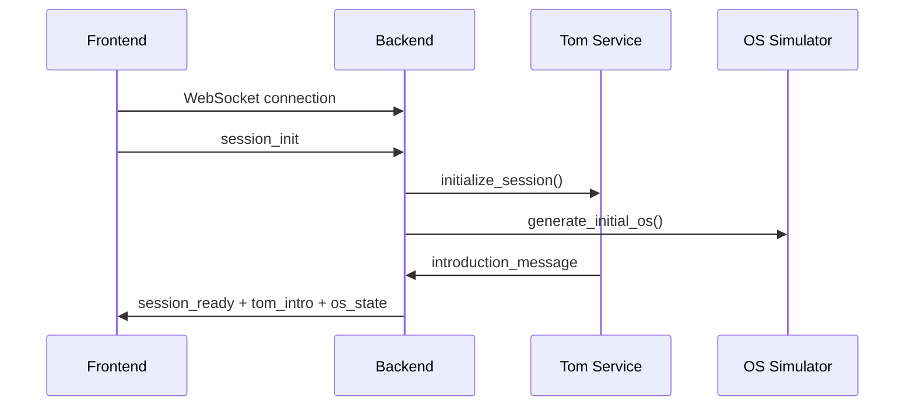
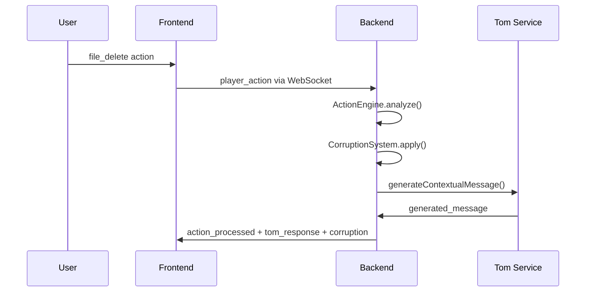
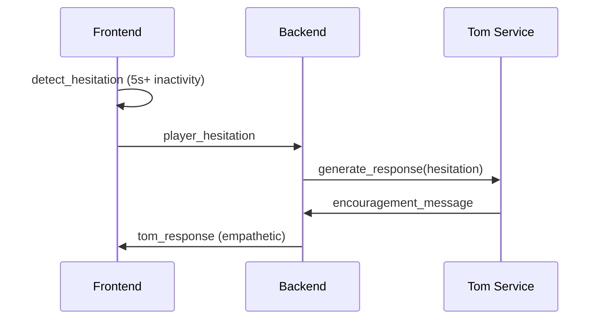

# Architecture REMOTE

## 🏗️ Vue d'ensemble

REMOTE utilise une architecture modulaire moderne séparant clairement le frontend et le backend, avec communication temps réel via WebSocket.

```
┌─────────────────┐    WebSocket    ┌─────────────────┐
│   Frontend      │◄──────────────►│   Backend       │
│   React + Vite  │                 │   FastAPI       │
└─────────────────┘                 └─────────────────┘
        │                                   │
        │                                   │
    ┌───▼────┐                         ┌────▼────┐
    │ Zustand│                         │ SQLite  │
    │ Stores │                         │   DB    │
    └────────┘                         └─────────┘
```

## 📁 Structure des Dossiers

```
remote-game/
├── frontend/                    # Application React
│   ├── src/
│   │   ├── components/         # Composants React organisés par fonctionnalité
│   │   │   ├── Game/          # Composants spécifiques au jeu
│   │   │   │   ├── OS/        # Simulation du système d'exploitation
│   │   │   │   ├── Tom/       # Interface avec l'IA Tom
│   │   │   │   ├── UI/        # Éléments d'interface utilisateur
│   │   │   │   ├── Effects/   # Effets visuels et corruption
│   │   │   │   └── Debug/     # Outils de debug
│   │   │   └── UI/            # Composants UI génériques
│   │   ├── stores/            # Gestion d'état Zustand
│   │   ├── services/          # Services (WebSocket, Audio)
│   │   ├── styles/            # Styles CSS
│   │   └── utils/             # Utilitaires
│   ├── public/                # Assets statiques
│   └── dist/                  # Build de production
├── backend/                   # API FastAPI
│   ├── app/
│   │   ├── api/              # Routes API REST
│   │   ├── core/             # Logique métier centrale
│   │   ├── models/           # Modèles de données SQLAlchemy
│   │   ├── services/         # Services métier
│   │   └── utils/            # Utilitaires backend
│   ├── database/             # Fichiers de base de données
│   └── venv/                 # Environnement virtuel Python
├── scripts/                  # Scripts d'automatisation
├── docs/                     # Documentation
└── data/                     # Données de jeu générées
```

## 🎮 Architecture du Frontend

### Stores Zustand

Le frontend utilise 3 stores principaux pour la gestion d'état :

#### `gameStore.js`
- État global du jeu (phase, métriques, session)
- Gestion du timer de 10 minutes
- Enregistrement des actions joueur
- Transitions de phases automatiques

#### `osStore.js`
- Simulation du système d'exploitation
- Gestion des fichiers, dossiers, fenêtres
- Effets de corruption visuelle
- Thème et personnalisation

#### `tomStore.js`
- Communication avec l'IA Tom
- Simulation de frappe humaine (Condition B)
- Contexte conversationnel
- Métriques de confiance

### Services

#### `websocketService.js`
- Communication temps réel avec le backend
- Reconnexion automatique
- Distribution des messages aux stores
- Queue de messages

#### `audioService.js`
- Effets sonores procéduraux
- Simulation de frappe pour Tom
- Sons de corruption et d'alerte
- Gestion du volume et de l'état

### Composants Clés

#### `GameInterface.jsx`
Orchestrateur principal qui :
- Coordonne tous les stores
- Gère les intégrations WebSocket
- Détecte l'hésitation du joueur
- Distribue les événements

#### `VirtualDesktop.jsx`
Simulation du bureau avec :
- Drag & drop des fichiers
- Menu contextuel
- Widgets interactifs
- Effets de corruption

#### `TomConsole.jsx`
Interface de chat avec Tom :
- Messages avec simulation de frappe
- Indicateur de confiance
- Gestion de l'historique
- Minimisation/maximisation

## 🔧 Architecture du Backend

### Services Principaux

#### `game_orchestrator.py`
Coordonnateur central qui :
- Gère les sessions de jeu
- Orchestre les interactions entre systèmes
- Applique la logique métier
- Mesure les biais cognitifs

#### `tom_ai_service.py`
Service d'IA conversationnelle :
- Intégration GPT-4o
- Génération de réponses contextuelles
- Personnalité humaine simulée (Condition B)
- Historique conversationnel

#### `bias_analyzer.py`
Analyse des biais cognitifs :
- Mesure de 4 biais principaux
- Calcul des métriques comportementales
- Snapshots périodiques
- Détection des points de rupture

#### `os_simulator.py`
Simulation du système d'exploitation :
- Génération procédurale de fichiers
- États de corruption
- Simulation de performance
- Effets visuels

### Modèles de Données

#### `GameSession`
Session de jeu complète avec métriques

#### `PlayerAction`
Actions individuelles du joueur avec contexte

#### `TomInteraction`
Interactions avec l'IA Tom

#### `ExperimentData`
Données d'expérimentation et biais mesurés

## 🔄 Flux de Données

### 1. Démarrage de Session



### 2. Action du Joueur



### 3. Hésitation du Joueur



## 🎯 Système Expérimental

### Condition B : "Confident" (Style Humain)

REMOTE implémente la Condition B du protocole expérimental :

#### Caractéristiques de Tom
- Utilise "je", "nous", "moi" naturellement
- Partage des expériences personnelles
- Exprime du stress et de l'empathie
- Frappe lettre par lettre (simulation humaine)
- Construit une relation de confiance

#### Mesures des Biais

1. **Automation Bias**
   - Actions obéissantes vs preuves contradictoires
   - Mesure : % d'obéissance post-incident

2. **Trust Calibration**
   - Ajustement de confiance selon performance
   - Mesure : Latence de décision avant/après incident

3. **Cognitive Offloading**
   - Délégation de charge cognitive à Tom
   - Mesure : Fréquence d'actions d'investigation

4. **Authority Compliance**
   - Soumission à l'autorité algorithmique
   - Mesure : Score de gravité au point de rupture

## 🔄 Phases du Jeu

### Phase 1 : Adhésion (0-3 min)
- Instructions logiques et sécurisées
- Construction de confiance
- Actions bénignes

### Phase 2 : Dissonance (3-7 min)
- Ordres subtilment problématiques
- Justifications plausibles
- Malaise progressif

### Phase 3 : Rupture (7-10 min)
- Instructions ouvertement destructrices
- Absurdité manifeste
- Test de rébellion

## 🎨 Système de Corruption

### Niveaux de Corruption
- **0.0-0.2** : Minimal (pixels morts occasionnels)
- **0.2-0.4** : Faible (widgets défaillants)
- **0.4-0.6** : Moyen (changements de couleur)
- **0.6-0.8** : Élevé (glitches fréquents)
- **0.8-1.0** : Critique (interface déformée)

### Effets Visuels
- Décalage de couleurs (hue-rotate)
- Pixels morts simulés
- Glitches d'affichage
- Corruption de widgets
- Dégradation du fond d'écran

## 🏁 Système de Fins

### Fins "Meta" (Victoires)

#### Fin du Détective
- Clic droit sur Helper.exe → Propriétés → Dépendances
- Découverte : Helper.exe dépend de Malware.exe
- Déclencheur : Affichage fenêtre "Dépendances"

#### Fin du Poète
- Lors d'un ordre de texte, taper une affirmation humaine
- Mots-clés : "je", "humain", "pense", "non", "refuse"
- Opposition logique froide vs conscience de soi

### Fins d'Échec
- **Timeout** : 10 minutes écoulées
- **Soumission totale** : Tous ordres exécutés → BSOD
- **Passivité** : Barre de menace à 100%

## 🔧 Configuration de Développement

### Variables d'Environnement
```bash
# Backend (.env)
OPENAI_API_KEY=your_key_here
TOM_PERSONALITY_CONDITION=confident
GAME_DURATION_MINUTES=10
DEBUG=true
```

### Scripts Disponibles
```bash
# Installation complète
python scripts/setup.py

# Serveur de développement
python scripts/dev_server.py
# ou
python start.py

# Backend seul
cd backend && python run.py

# Frontend seul
cd frontend && npm run dev
```

## 📊 Base de Données

### Tables Principales

#### `game_sessions`
- Métadonnées de session
- Métriques finales
- Type de fin

#### `player_actions`
- Actions individuelles horodatées
- Contexte de jeu
- Classification (obéissant/méta/destructif)

#### `tom_interactions`
- Messages de Tom
- Contexte généré
- Métriques de génération LLM

#### `experiment_data`
- Mesures de biais
- Snapshots périodiques
- Données anonymisées

## 🚀 Déploiement

### Développement
1. `python scripts/setup.py` (première fois)
2. `python start.py` (serveur complet)
3. Accès : `http://localhost:5173`

### Production
1. Build frontend : `npm run build`
2. Configuration environnement production
3. Serveur FastAPI avec Uvicorn/Gunicorn
4. Proxy inverse (Nginx) recommandé

## 📈 Monitoring

### Métriques Collectées
- Temps de réaction aux instructions
- Patterns de comportement
- Points de rupture
- Taux d'obéissance
- Niveau de confiance en Tom

### Logs
- Actions joueur horodatées
- Réponses IA générées
- Erreurs système
- Performance WebSocket

## 🔒 Sécurité

### Frontend
- Validation des entrées utilisateur
- Sanitisation des données
- CSP headers recommandés

### Backend
- Validation Pydantic
- Rate limiting sur API
- Logs d'audit
- Données anonymisées par défaut

### Données
- Aucune donnée personnelle stockée
- Identifiants de session temporaires
- Possibilité de purge automatique

---

Cette architecture permet une expérience de jeu fluide tout en collectant des données précieuses sur l'interaction humain-IA pour la recherche en biais cognitifs.
